# Connecting your AI subscription

## Why

Your Zo needs a brain to think with. You already pay for one — your ChatGPT or
Claude subscription — so we point Zo at that instead of buying a second one.

**Nothing extra to pay.** This is the subscription you already have, doing more
work.

## First, the names do not match

This is the one part that catches people out. On the Zo screen the buttons are
named after the developer tools, not after what you pay for:

| You pay for | Click Connect next to |
|---|---|
| **ChatGPT** | **Codex** |
| **Claude** | **Claude Code** |

If you pay for ChatGPT and go looking for a button saying ChatGPT, you will not
find one. It says **Codex**.

Only pick the one you actually pay for. Connecting the other will ask you to
sign in to an account you do not have.

## Getting to the right screen

1. **Click Settings, then the AI tab**
   The gear at the bottom of the left-hand menu, then **AI**, the first tab.
   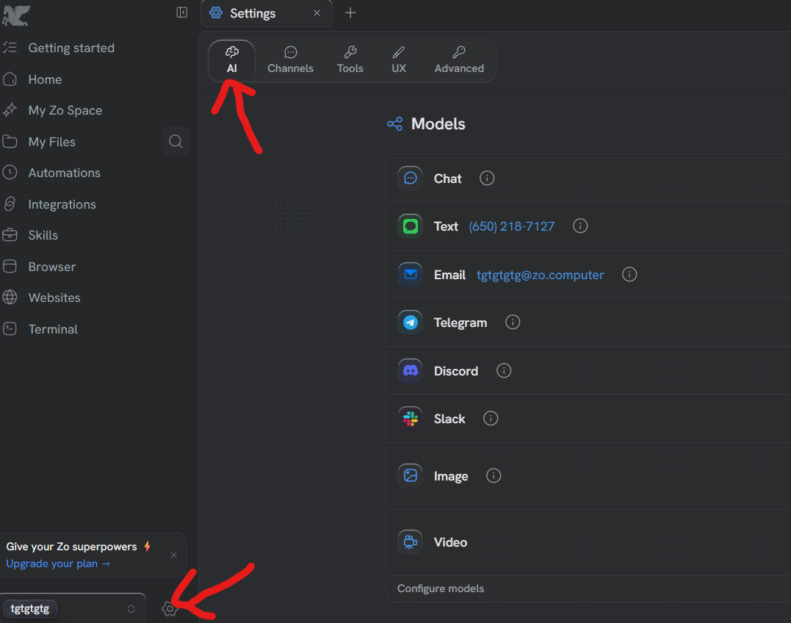

2. **Scroll down to Providers**
   Past the list of models, to the part headed Providers.
   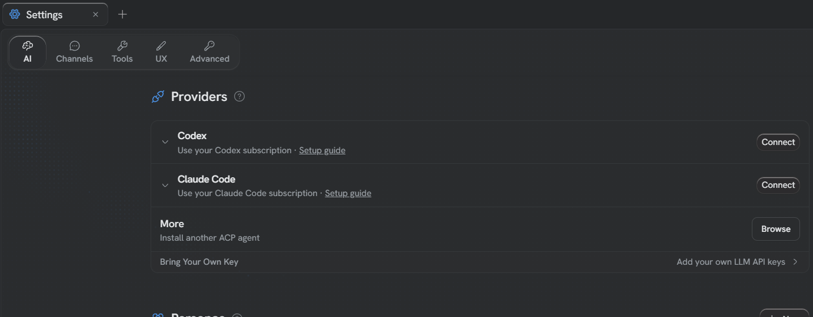

3. **Click Connect on the one you pay for**
   **Codex** if you pay for ChatGPT. **Claude Code** if you pay for Claude.
   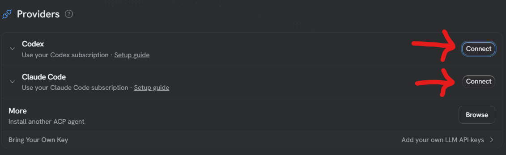

Now follow whichever of the two below matches what you clicked.

## If you clicked Codex (you pay for ChatGPT)

The code goes **from Zo to the sign-in page**. Copy it first, then go.

1. **Copy the one-time code**
   Zo shows a short code like `V3QC-I2INZ`. Click the copy button beside it.
   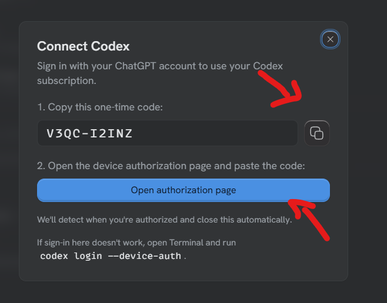

2. **Click Open authorization page and sign in**
   Sign in with the ChatGPT account you pay for.
   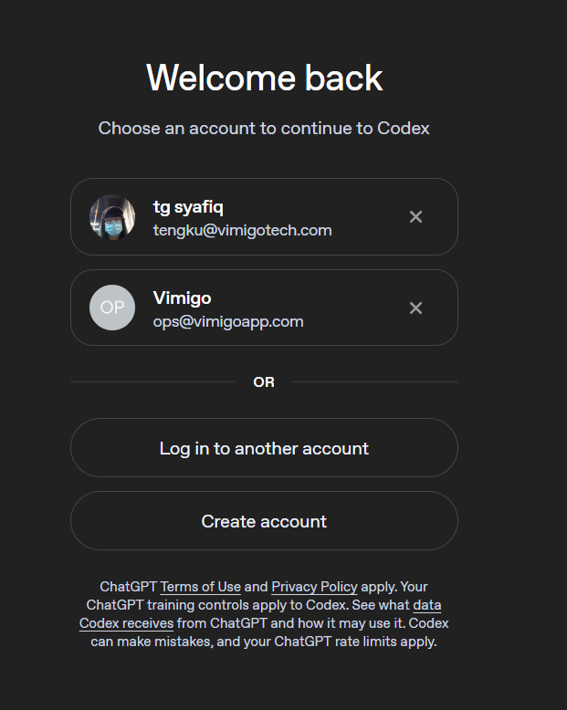

3. **Paste the code**
   Paste the code you copied in step 1, and confirm.
   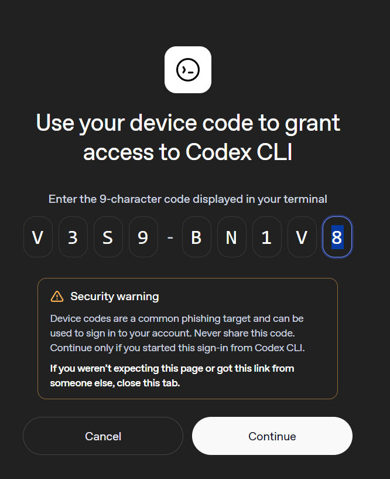

4. **Turn the models on**
   Back in Zo, switch the models on so it can use them.
   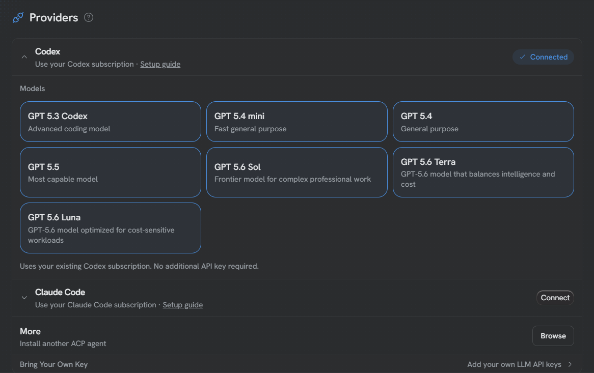

Zo notices on its own when you are done and closes the box.

## If you clicked Claude Code (you pay for Claude)

The code goes **the other way** — from the sign-in page back to Zo. Go first,
copy afterwards.

1. **Click Open authorization page**
   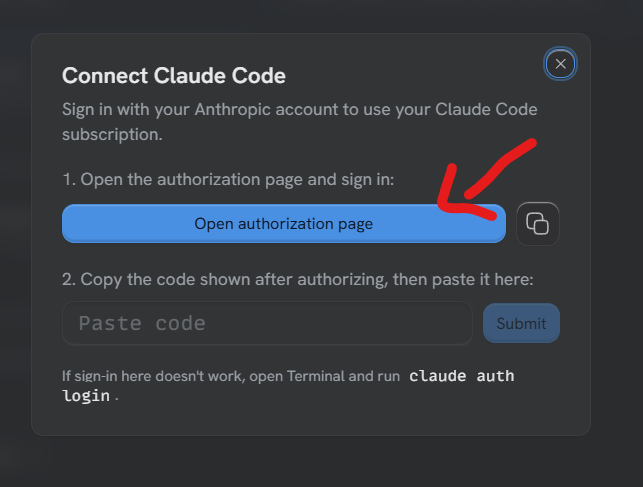

2. **Sign in, then click Authorize**
   Anthropic lists what Zo will be allowed to do, then asks you to confirm.
   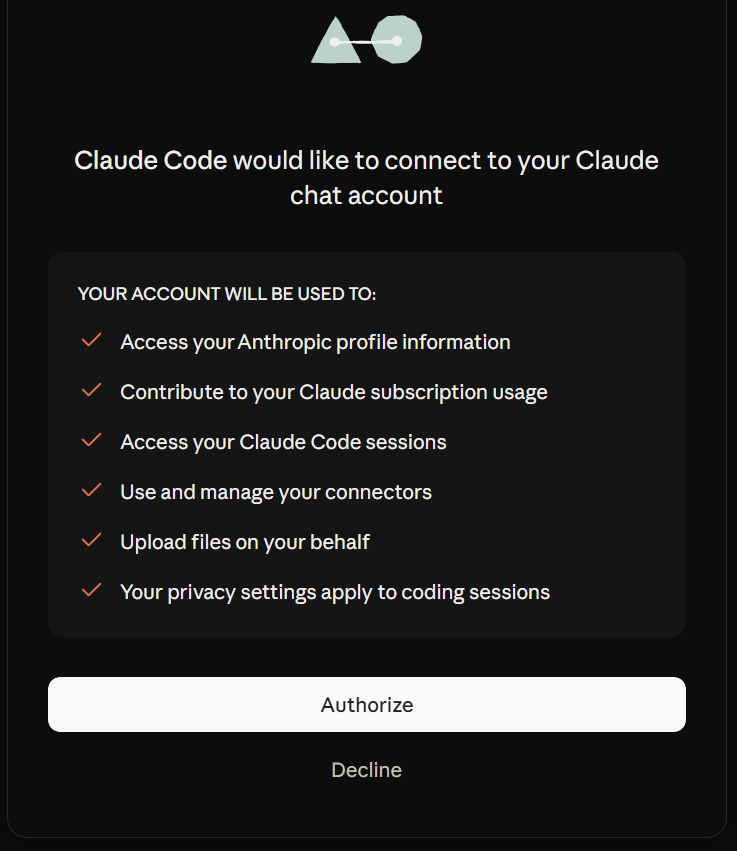

3. **Copy the code it gives you**
   After authorizing, Anthropic shows a long code. Copy it.
   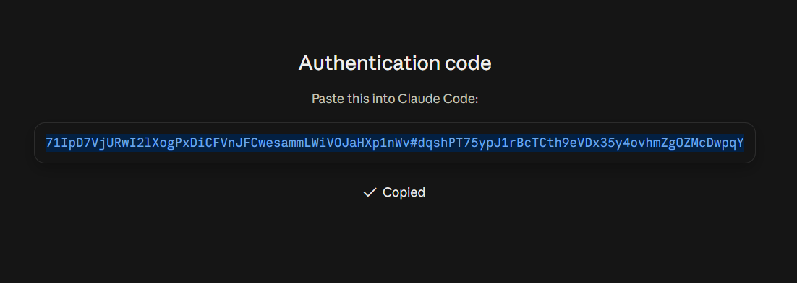

4. **Paste it back into Zo and click Submit**
   Back in the Zo box, paste the code into the field and click **Submit**.
   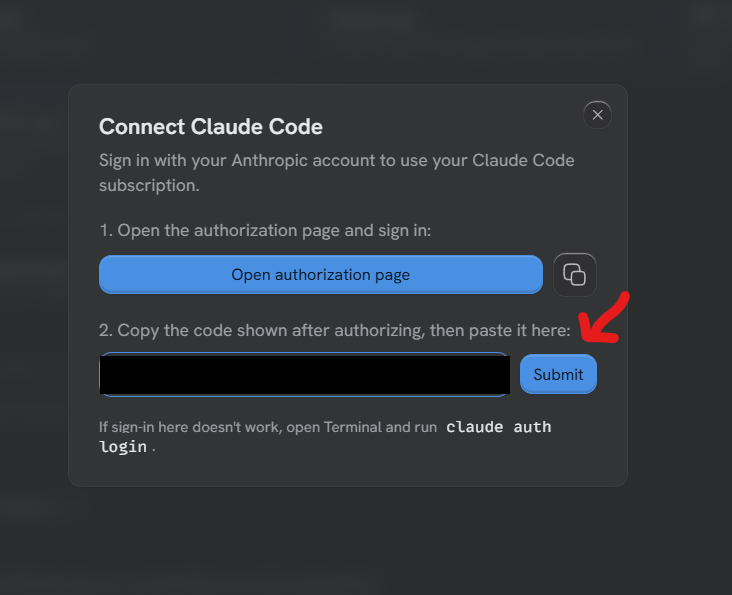

5. **Turn the models on**
   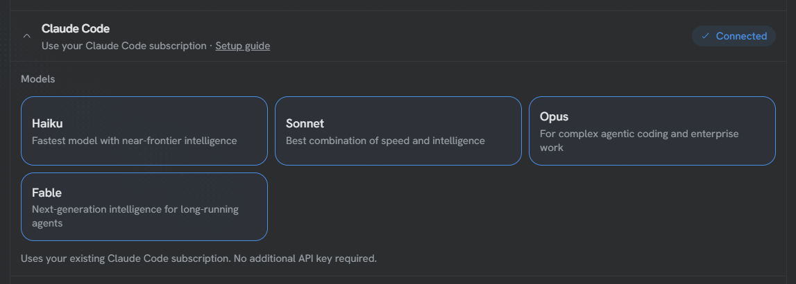

## Careful

These two run in opposite directions, so do not go by memory if you have done
the other one before:

- **Codex** — copy the code, *then* go and sign in.
- **Claude Code** — go and sign in, *then* copy the code back.

If a code is refused, it has probably expired. Close the box, click Connect
again, and use the fresh one.
