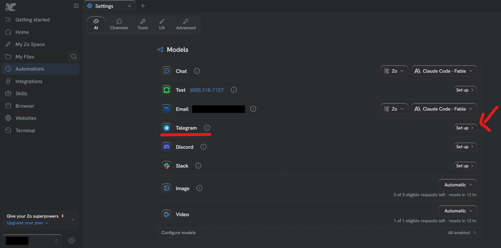

# Talking to your Zo from your phone

## Why

Right now you can only talk to your Zo when you are sitting at this computer.

Link Telegram and you can message it from your phone, from anywhere — like
texting a colleague who is always at their desk. Ask it something on the way to
a meeting and the answer is waiting for you.

Telegram is a free messaging app, like WhatsApp. If you do not already use it,
you will need to install it on your phone first.

## Steps

1. **Click Settings, then the AI tab**
   The gear at the bottom of the left-hand menu, then **AI**, the first tab.

2. **Find Telegram in the list and click Set up**
   It sits in the list of ways to reach your Zo — Chat, Text, Email, Telegram,
   Discord, Slack. Click **Set up** on the Telegram row.
   

3. **Follow what Zo asks**
   It will send you to Telegram to connect the two. Everything from here happens
   on your phone.

## Careful

Anyone who can message that Telegram account can ask your Zo things. Keep it to
your own account, and do not add it to a group chat.

This one is entirely optional. Skipping it changes nothing else — your Zo works
exactly the same from this computer.
