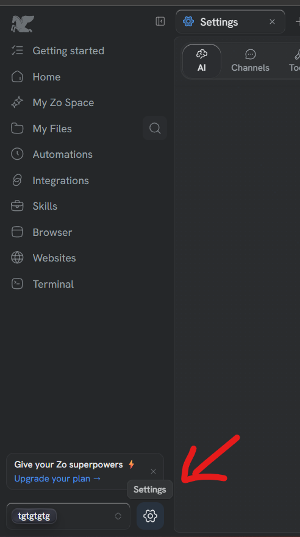
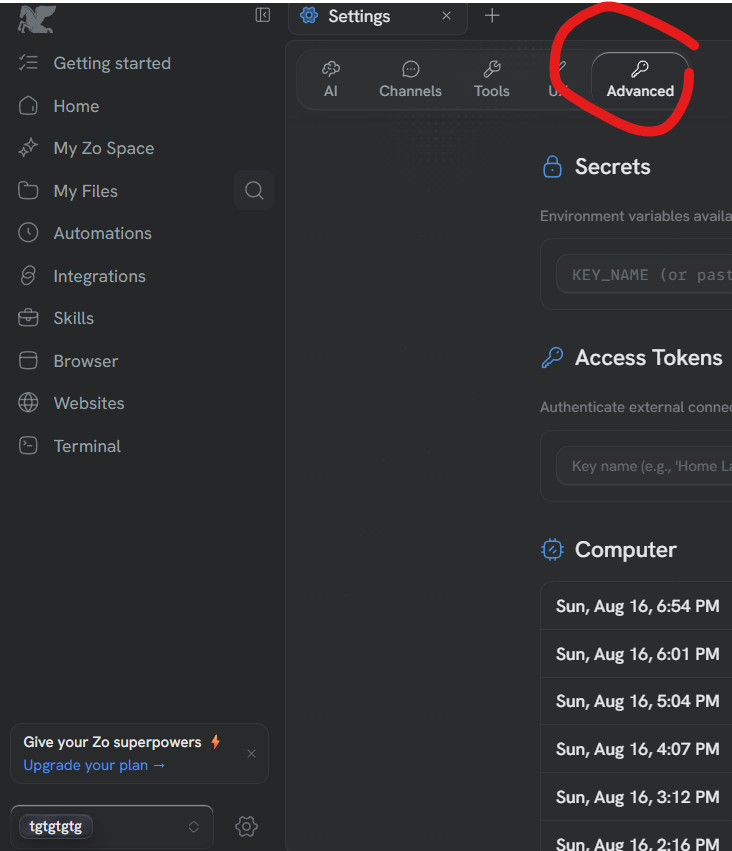
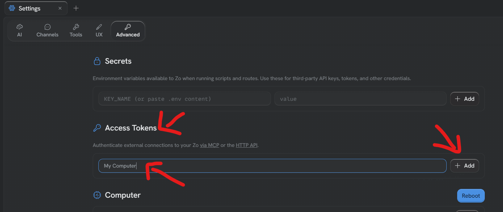
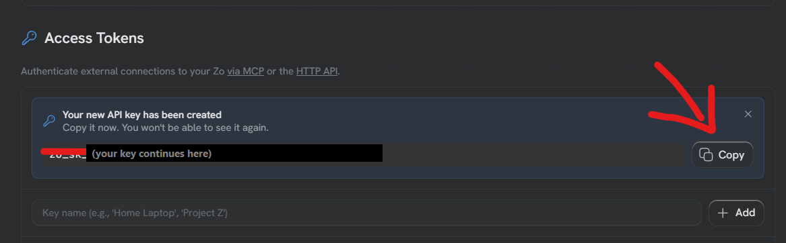

# Getting your Zo key

## Why

Your Zo needs to let Claude and ChatGPT talk to it, and a key is how it knows
it is really you asking. You make it once and you never think about it again.

## Steps

1. **Click Settings**
   The gear at the bottom of the left-hand menu.
   

2. **Click Advanced**
   Along the row of tabs at the top — AI, Channels, Tools, UX, Advanced. It is
   the last one.
   

3. **Find Access Tokens and give the key a name**
   Scroll down to the part headed Access Tokens. Type any name you like in the
   box — *my computer* is fine — then click **Add**.
   

4. **Copy the key**
   Zo shows you a long line starting `zo_sk_`. Click **Copy**, then paste it to
   me here.
   

## Careful

Zo shows this key **once**, and says so on the screen. If you close that box
before copying it, nothing is broken — just make another one the same way.

Nobody needs this key except your own computer. Do not send it to anyone,
including anyone claiming to be from Vimigo.
